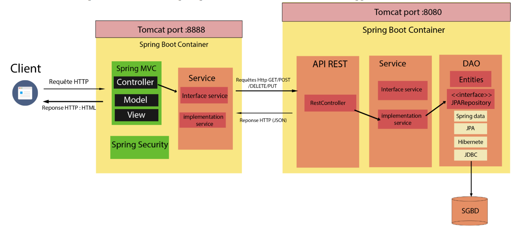
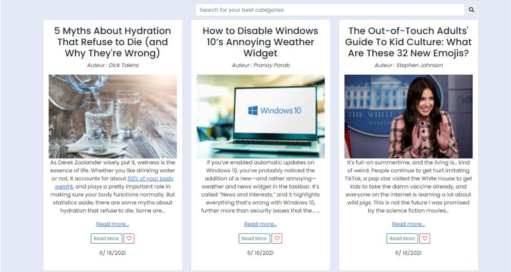
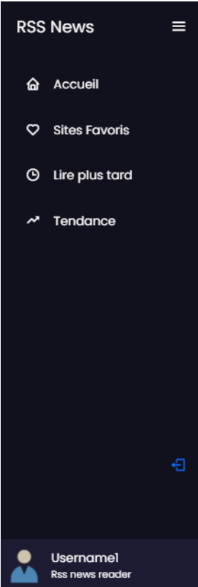
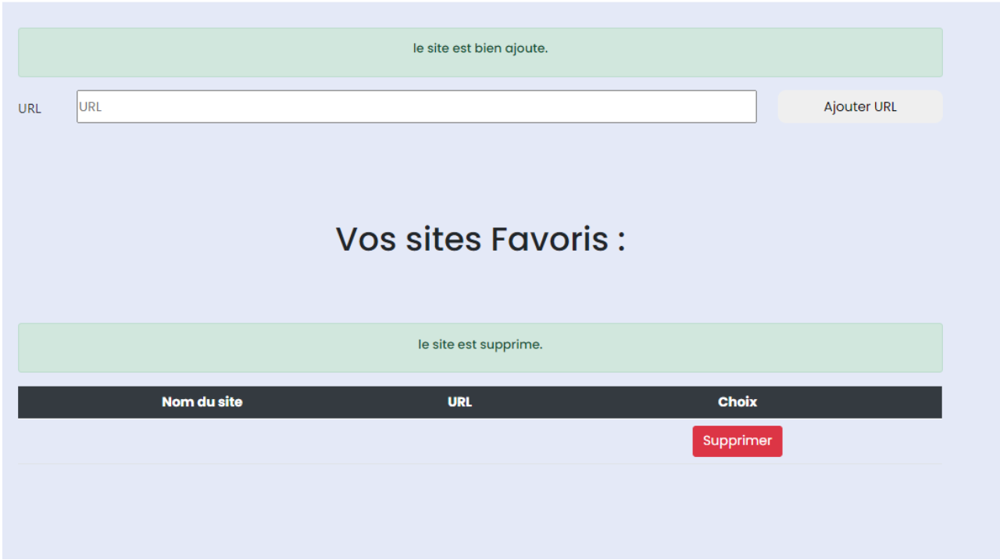
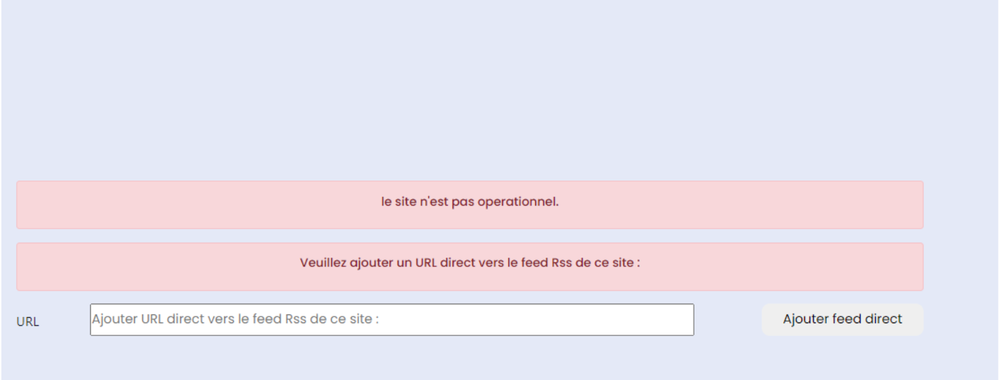
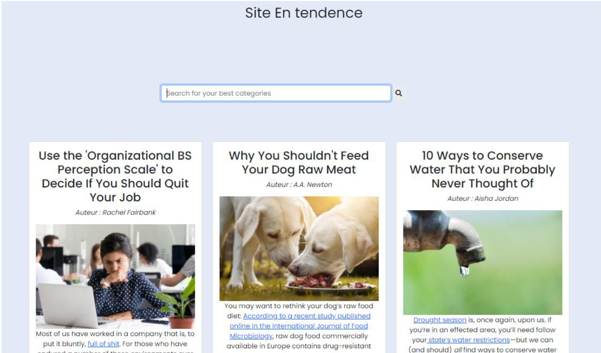
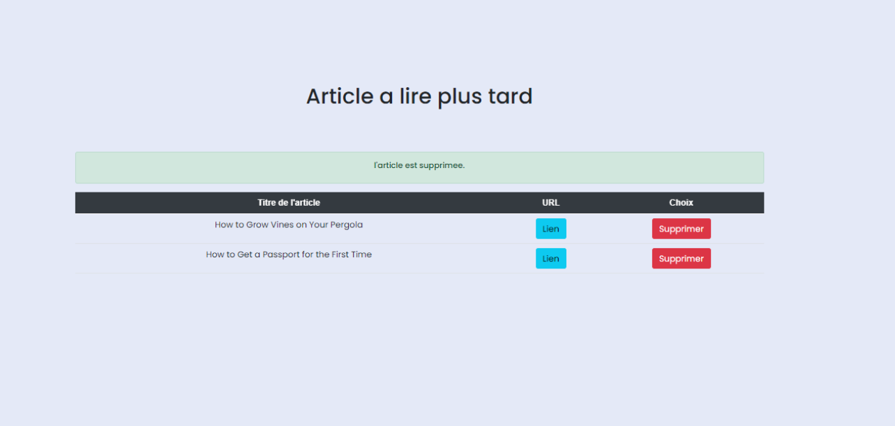

# News site aggregation system via RSS

- The news aggregator is a web application, developed using JEE, that organizes and highlights in a personalized way the information from several websites that interest our users.

## Project architecture
- The architecture represents the different parts of our project: a part of web service that will provide services that will be in the form of a Restful API (named **MiniProjetV1**). these services will then be consumed by the client (named **ClientMiniProjetV1**).  The intermediate part is in the form of a Spring MVC project and using the Spring Security framework. This division is for the simplification of the project structure. 

## Presentation of the project
### Login page

### Home
- After the authentication, the user accesses this page. This is the main page of our website, while here the user can consult the articles of the sites where he is subscribed, as well as filter these articles from the category where they belong

### Side Bar

### Add sites page
- The user can manage the sites where the articles come from by typing the address of that site.

-  After the user adds a news site address, before adding it to our database and using it, a check is made on the site to test if it is a site with RSS technology.

### Trend page
- The trend page gives articles from the most popular press sites chosen by all our users and displays the corresponding articles

### "Read later" page
-  When users are browsing either the home page or the trend page, the user may need to save the article in order to read it later. This feature is done via the logo in the form of a "heart" with each click the article is forwarded to the page to be viewed later.

